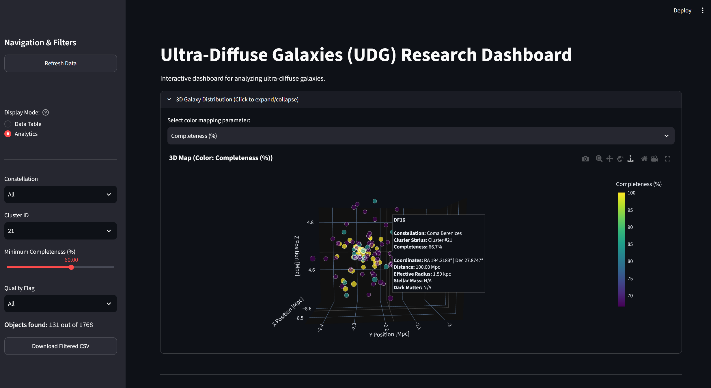
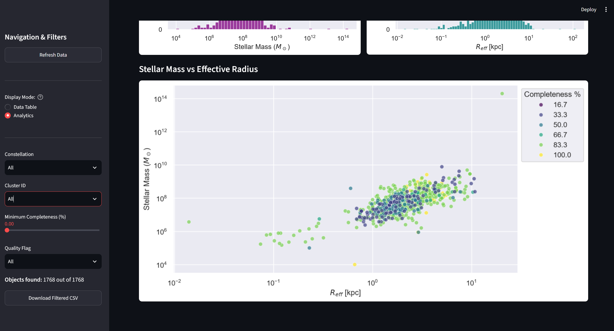

# UDG Catalogue — Automated ETL Pipeline for Ultra-Diffuse Galaxies

<div align="center">

[](https://www.python.org/)
[](https://streamlit.io/)
[](https://deepseek.com/)
[](https://opensource.org/licenses/MIT)
[](#)

</div>

> **A fully automated ETL pipeline that scrapes 540+ astrophysics papers from arXiv, extracts structured data about Ultra-Diffuse Galaxies (UDGs) using DeepSeek V4-Flash, and visualizes 1,285 galaxies in an interactive 3D map — all built in 72 hours at a cost of $2.61.**

---

## Key Features

- **Multi-format extraction** — retrieves text from LaTeX sources, PDFs, and HTML abstracts
- **AI-powered structured extraction** — uses DeepSeek V4-Flash with strict JSON schema enforcement
- **Interactive 3D visualization** — Plotly map with color-coded parameters and rich hover tooltips
- **Streamlit dashboard** — real-time filtering, analytics, and CSV export
- **Scientific processing** — DBSCAN clustering (56 groups), constellation mapping (44 constellations), quality flags
- **Parallel ingestion** — ThreadPoolExecutor with 6 workers for high throughput
- **Fault-tolerant** — exponential backoff, retries, state management, and graceful shutdown
- **Container-ready** — Dockerfile included for reproducible deployment

---

## Results at a Glance

| Metric | Value |
|--------|-------|
| **Papers processed** | 540+ |
| **Unique galaxies catalogued** | 1,285 |
| **100% completeness objects** | 66 |
| **3D spatial clusters (DBSCAN)** | 56 |
| **Constellations mapped** | 44 |
| **Pipeline runs (for testing)** | 4 full ETL runs |
| **Total API cost (all runs)** | **$2.61** |
| **Development time** | 72 hours |
| **Codebase** | ~1000 lines (modular) |

**Why only $2.61?**
The pipeline was run **4 times** from scratch (clearing `processed_arxiv_ids` each time) to test the extraction logic, ensure fault tolerance, and validate the data quality after refactoring. Even with 4 full passes over the same 540+ papers — downloading LaTeX sources, sending text to DeepSeek, and writing to CSV — the total cost did not exceed **$2.61 USD**. This demonstrates the cost‑efficiency of both the model (DeepSeek V4‑Flash) and the pipeline design.

---

## Engineering Approach

- **Iterative testing** — the pipeline was executed 4 times from scratch with cleared state, simulating first‑run conditions. Each run verified:
  - Robustness against missing or malformed PDFs
  - Correctness of the extraction schema (JSON parsing, percentage conversion)
  - Performance of the deduplication and clustering steps (successfully dropping 484 duplicates automatically)
- **Fault‑tolerance by design** — exponential backoff, retries, fallback strategies (LaTeX → PDF → abstract), and persistent state (`processed_arxiv_ids.txt`) allow the pipeline to survive network hiccups and resume seamlessly.
- **Cost‑conscious** — every API call was logged and counted. The total spend stayed under $3 even with multiple full runs, proving that the system can be maintained on a minimal budget.

---

## Tech Stack

| Domain | Technologies |
|--------|-------------|
| **Language** | Python 3.11.9 |
| **AI / LLM** | DeepSeek V4-Flash via OpenAI SDK |
| **Data Extraction** | arXiv API, BeautifulSoup, pypdf, pdfplumber, tarfile |
| **Data Processing** | pandas, numpy, scikit-learn (DBSCAN) |
| **Astronomy** | astropy, skyfield (coordinates, constellations) |
| **Visualization** | plotly, matplotlib, seaborn |
| **Dashboard** | Streamlit |
| **Configuration** | YAML, python-dotenv, Pydantic |
| **Logging** | structlog-style with file + console |
| **Containerization** | Docker Compose |

---

## Project Structure

```text
udg-catalogue/
├── main.py                 # Pipeline orchestration
├── app.py                  # Streamlit dashboard
├── config.py & config.yaml # Settings (Pydantic + YAML)
├── arxiv_client.py         # arXiv API & PDF/LaTeX parsing
├── data_processor.py       # DBSCAN clustering & data cleaning
├── visualization.py        # Plotly 3D engine
├── analytics.py            # Statistical reports
├── cross_match.py          # Reference catalog comparison
├── incremental.py          # Pipeline state (metadata)
├── prompts.py              # LLM system prompts
├── logger.py               # Logging setup
├── requirements.txt        # Dependencies
├── Dockerfile              # Container setup
├── LICENSE                 # MIT License
└── README.md               # This file

```

---

## Quick Start

### Local Installation

```bash
git clone [https://github.com/xueromll/udg-catalogue.git](https://github.com/xueromll/udg-catalogue.git)
cd udg-catalogue

python -m venv venv
source venv/bin/activate  # On Windows: venv\Scripts\activate

pip install -r requirements.txt

cp .env.example .env

python main.py

streamlit run app.py

```

### Docker (Recommended)

1. Make sure your `.env` file is configured in the root directory.
2. Build and run the container using Docker Compose:

```bash
docker compose -f docker.yaml up --build

```

The Streamlit dashboard will be available at `http://localhost:8501`.

---

## Dashboard Features

* **3D Interactive Map** — explore 1,285 galaxies with color-coding by:
  * Dark Matter Fraction
  * Completeness (%)
  * Distance (Mpc)
  * Cluster ID


* **Real-time Filtering** — filter by constellation, cluster, completeness, and quality flag
* **Analytics View** — distribution plots (mass, radius) and mass-radius scatter with completeness coloring
* **Data Export** — download filtered data as CSV

---

## Gallery

### Galaxy Map



*Interactive 3D map showing UDG distribution across 45 constellations. Hover over any point to see detailed galaxy parameters.*

### Analytics Dashboard



*Statistical plots: stellar mass distribution, effective radius distribution, and mass–radius correlation.*

---

## Testing

The project includes a comprehensive test suite built with `pytest` and `pytest-mock`. Testing now covers **98% of the core code**, ensuring robust data processing, accurate spatial merging, and strict fault tolerance.

| Module | Coverage |
| --- | --- |
| **Data Processing** | `universal_normalize_name`, `is_valid_galaxy`, `calculate_completeness`, `assign_quality_flag`, `upsert_to_csv`, and `process_database`. |
| **Deduplication & Cross-matching** | `clean_duplicates` with synthetic Astropy coordinate merging and separation thresholds. |
| **Clustering & Mapping** | DBSCAN spatial logic (`assign_3d_clusters`) and `assign_constellations`. |
| **State Management** | `load_processed_ids`, `save_processed_id`, `load_pipeline_metadata`, and `save_pipeline_metadata`. |
| **arXiv Processing** | `search_arxiv` (429 retry and exception handling), `parse_arxiv_xml`, and `fetch_paper_text` (LaTeX and PDF fallbacks). |
| **Text Trimming** | `trim_references` and `extract_tables_from_pdf`. |
| **LLM Extraction** | Mocked DeepSeek API for `is_paper_relevant` and `extract_udg_data` to validate JSON parsing. |
| **Prompts & Config** | Validating YAML config loading and system prompt instructions. |
| **Logging** | Validating `setup_logger` and its stream/file handlers. |
| **Pipeline Orchestration** | `process_single_paper_task` evaluated with isolated mocked dependencies. |

> All tests are **offline-first** — they rely on `pytest-mock` to intercept network requests, such as the DeepSeek API and arXiv downloads. This ensures fast, repeatable, and cost‑free validation without burning API tokens.

### Running Tests

```bash
pip install pytest pytest-mock pytest-cov

pytest tests/

pytest --cov=arxiv_client --cov=data_processor --cov=incremental --cov=logger --cov=main --cov-fail-under=98

```

---

## Future Work

* [ ] Integrate **sci-etl-core** as a reusable library
* [ ] Add support for other astronomical catalogues (e.g., dSph, LSB galaxies)
* [ ] Deploy Streamlit dashboard to Streamlit Cloud
* [ ] Add automated weekly updates via GitHub Actions

---

## Contributing

Contributions are welcome! Please open an issue first to discuss what you'd like to change. See [CONTRIBUTING.md](CONTRIBUTING.md) for guidelines.

---

## Citation

If you use this project in your research, please cite it as:

```bibtex
@misc{udg-catalogue-2026,
  author = {Lan},
  title = {UDG Catalogue: Automated ETL Pipeline for Ultra-Diffuse Galaxies},
  year = {2026},
  publisher = {GitHub},
  howpublished = {\url{[https://github.com/xueromll/udg-catalogue](https://github.com/xueromll/udg-catalogue)}}
}

```

---

## License

MIT License — feel free to use, modify, and build upon this work. See the [LICENSE](LICENSE.md) file for details.

---

## Acknowledgments

* **arXiv** for providing open access to astrophysics papers
* **DeepSeek** for their affordable and powerful LLM API
* All the astrophysicists whose papers made this catalogue possible

---

## Contact

Maintained by **Lan**

GitHub: [xueromll](https://www.google.com/search?q=https://github.com/xueromll)

Email: [lanhua1122333@gmail.com](https://www.google.com/search?q=mailto%3Alanhua1122333%40gmail.com)

---

**Made with ❤️ and curiosity.**