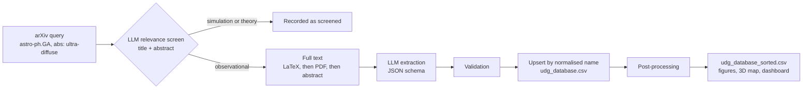

# UDG Catalogue — Automated ETL Pipeline for Ultra-Diffuse Galaxies

<div align="center">

[](https://www.python.org/)
[](https://github.com/xueromll/sci-etl-core)
[](https://streamlit.io/)
[](https://deepseek.com/)
[](#testing)
[](LICENSE)

</div>

> **An automated pipeline that screens astrophysics papers on arXiv and extracts measurements of ultra-diffuse galaxies (UDGs) with DeepSeek V4-Flash. It publishes the results as a cross-matched catalogue of 1,285 objects, explorable through an interactive 3D map and a Streamlit dashboard.**
>
> The ETL machinery comes from [sci-etl-core](https://github.com/xueromll/sci-etl-core): arXiv access, LLM steps, CSV upserts, resumable state and dataframe processors. This repository holds the astronomy: prompts, galaxy naming and validation rules, sky-position matching, clustering features and the dashboard.

---

## Quickstart

```bash
git clone https://github.com/xueromll/udg-catalogue.git && cd udg-catalogue
python -m venv .venv && source .venv/bin/activate
pip install -r requirements.txt
cp .env.example .env
python main.py
streamlit run app.py
```

Set `DEEPSEEK_API_KEY` in `.env` before running the pipeline. The dashboard also works without it, because it reads the committed `udg_database_sorted.csv`. For all options, see [Installation and Usage](#installation-and-usage).

## Key Features

- **Literature screening.** An LLM reads each title and abstract and excludes papers based purely on simulations or theory, such as IllustrisTNG, FIRE or EAGLE studies.
- **Multi-format extraction.** The pipeline reads LaTeX sources first (tarballs or single gzipped files, assembled in document order), then PDFs including their tables, and uses the abstract only as a last resort.
- **Structured LLM extraction.** DeepSeek V4-Flash runs in JSON mode, and every extracted galaxy must pass validation rules before it is stored.
- **Astrometric cross-identification.** Galaxy names are normalised, and records within 3″ on the sky are merged using astropy.
- **Derived columns.** Each object gets a completeness score, a quality flag, its IAU constellation and a 3D spatial group from DBSCAN.
- **Interactive exploration.** A Plotly 3D map and a Streamlit dashboard offer filtering, analytics and CSV export.
- **Fault tolerance.** Requests are retried with backoff, and CSV and state writes are crash-safe. Papers that fail are retried on the next run instead of being marked done.
- **Bounded async ingestion.** Up to six papers are processed at once.
- **Container-ready.** A Dockerfile and a Compose file are included.

---

## Results at a Glance

| Metric | Value |
|--------|-------|
| **arXiv submissions screened** | 540+ |
| **Unique galaxies catalogued** | 1,285 |
| **Objects with all six parameters (`Confirmed`)** | 66 (5.1%) |
| **Objects with sky position and distance (3D map)** | 757 |
| **3D spatial groups (DBSCAN)** | 56 |
| **IAU constellations represented** | 43 |
| **Median record completeness** | 66.7% |
| **Literature snapshot** | 2026-08-05 |
| **Total API cost (four full runs)** | US$2.61 |
| **ETL framework** | sci-etl-core 0.2 |

### Parameter coverage

| Parameter | Column | Unit | Objects | Coverage | Median |
|---|---|---|---:|---:|---:|
| Right ascension, declination (ICRS) | `ra`, `dec` | deg | 1,004 | 78.1% | — |
| Distance | `distance_mpc` | Mpc | 958 | 74.6% | 40.2 |
| Effective radius | `effective_radius_kpc` | kpc | 997 | 77.6% | 1.74 |
| Stellar mass | `stellar_mass_solar` | M☉ | 681 | 53.0% | 6.3 × 10⁷ |
| Dark-matter fraction | `dark_matter_fraction` | — | 70 | 5.4% | 0.89 |

---

## How It Works



| Stage | What happens | Code |
|---|---|---|
| **Screening** | The query `cat:astro-ph.GA AND abs:ultra-diffuse` is paged from the newest submission. The LLM keeps papers with new observational UDG measurements. Every screened ID is saved and never screened again. | [pipeline.py](udg_catalogue/pipeline.py), [prompts.py](udg_catalogue/prompts.py) |
| **Extraction** | For each galaxy, the LLM returns `galaxy_name`, `ra`, `dec`, `distance_mpc`, `effective_radius_kpc`, `stellar_mass_solar` and `dark_matter_fraction`. Percentages are converted to fractions, and values the paper doesn't report are `null`. | [prompts.py](udg_catalogue/prompts.py) |
| **Validation** | A record is rejected if its name is missing or contains a simulation keyword as a whole word (e.g. `tng`, `mock`, `toy`). It is also rejected if RA/Dec fall outside [0°, 360°] / [−90°, 90°], or if all six measurements are empty. | [validation.py](udg_catalogue/validation.py) |
| **Name matching** | Names are compared after normalisation: NFKC and case folding, punctuation removed, `Dragonfly` → `DF`, leading zeros stripped. So `DF 44`, `DF-44` and `Dragonfly 044` match, while `KDG 44` and `DF 44` stay distinct. A new record only fills a stored row's missing values and never overwrites them. | [naming.py](udg_catalogue/naming.py) |
| **Sky matching** | Nearest neighbours are found with `SkyCoord.match_to_catalog_sky`. Rows within 3″ are merged, filling gaps without discarding values. | [astrometry.py](udg_catalogue/astrometry.py) |
| **Post-processing** | The dark-matter fraction is clipped to [0, 1], then completeness, constellation, spatial group and quality flag are computed, and rows are sorted. | [postprocess.py](udg_catalogue/postprocess.py) |

**Derived columns**

- `completeness_pct` is the share of the six measurements that are present.
- `quality_flag` is `Confirmed` at 100% completeness, `Needs Review` at ≥ 50% and `Low Confidence` below 50%. It reflects completeness only, not whether the object is a confirmed UDG.
- `constellation` is the IAU constellation of the position, from `SkyCoord.get_constellation`.
- `cluster_id` comes from DBSCAN (`eps = 5 Mpc`, `min_samples = 2`) run on heliocentric Cartesian coordinates $(D\cos\delta\cos\alpha,\ D\cos\delta\sin\alpha,\ D\sin\delta)$. It is −1 for ungrouped objects and for objects without a position or distance.

---

## Catalogue Schema

`udg_database_sorted.csv` has one row per object. Rows are sorted by completeness (descending), then by constellation, cluster and name.

| Column | Type | Unit | Description |
|---|---|---|---|
| `galaxy_name` | string | — | Designation as first extracted |
| `completeness_pct` | float | % | Share of the six measurements present |
| `quality_flag` | string | — | `Confirmed`, `Needs Review` or `Low Confidence` |
| `constellation` | string | — | IAU constellation, or `Unknown` without a valid position |
| `cluster_id` | integer | — | DBSCAN group label; −1 if ungrouped |
| `ra`, `dec` | float | deg | ICRS coordinates |
| `distance_mpc` | float | Mpc | Distance |
| `effective_radius_kpc` | float | kpc | Effective (half-light) radius |
| `stellar_mass_solar` | float | M☉ | Stellar mass |
| `dark_matter_fraction` | float | — | Dark-matter fraction in [0, 1] |

Empty cells mean the value was not reported or could not be extracted.

## Known Limitations

Values are extracted automatically, so check them against the original papers before using them in quantitative work.

- **Unchecked extraction.** No values were checked by hand, and a few are physically implausible (for example, one object has $M_\star > 10^{11}$ M☉).
- **No provenance or uncertainties.** The catalogue does not record which paper each value came from, and error bars and upper limits are discarded.
- **Mixed definitions.** Distance methods, photometric bands and dark-matter apertures differ between papers and are not recorded.
- **First value wins.** When papers disagree, the value from the first paper processed is kept.
- **No UDG definition imposed.** The catalogue takes each paper's classification as given and applies no size or surface-brightness cut, such as $R_\mathrm{e} \geq 1.5$ kpc and $\mu_{0,g} \geq 24$ mag arcsec⁻² ([van Dokkum et al. 2015](https://doi.org/10.1088/2041-8205/798/2/L45)).
- **Spatial groups are not bound structures.** With `min_samples = 2`, any two objects within 5 Mpc form a group, and distance errors are often of that size.
- **Remaining duplicates.** Name variants outside the normalisation rules (e.g. `N1052-DF2` and `NGC 1052-DF2`) are merged only when both records have coordinates.
- **Not exactly reproducible.** LLM output varies between runs, so a rebuild gives a similar catalogue, not an identical file.

---

## Tech Stack

| Domain | Technologies |
|--------|-------------|
| **Language** | Python 3.11 |
| **ETL framework** | sci-etl-core (arXiv extraction, LLM steps, CSV upsert, state, processors) |
| **AI / LLM** | DeepSeek V4-Flash through sci-etl-core's OpenAI-compatible client |
| **Document parsing** | pdfplumber, LaTeX parsing in sci-etl-core |
| **Data processing** | pandas, NumPy, scikit-learn (DBSCAN) |
| **Astronomy** | astropy (coordinates, cross-matching, constellations) |
| **Visualization** | Plotly, Matplotlib, seaborn |
| **Dashboard** | Streamlit |
| **Configuration** | YAML + `.env`, validated by Pydantic |
| **Containerization** | Docker Compose |

---

## Project Structure

```text
udg-catalogue/
├── main.py                  # Command-line entrypoint: ingest, post-process, report
├── app.py                   # Streamlit dashboard
├── config.yaml              # Pipeline, paths, clustering and deduplication settings
├── udg_catalogue/
│   ├── config.py            # CatalogueConfig, built on sci-etl-core's BaseAppConfig
│   ├── pipeline.py          # Assembles the sci-etl-core ingestion pipeline
│   ├── prompts.py           # LLM system prompts
│   ├── naming.py            # Galaxy name normalizer used as the catalogue key
│   ├── validation.py        # Rules every extracted galaxy must pass
│   ├── astrometry.py        # Sky matching, 3D features, constellations, cross-matching
│   ├── postprocess.py       # Processor chain that builds the sorted catalogue
│   ├── maps.py              # Plotly 3D map shared by main.py and the dashboard
│   └── analytics.py         # Statistical figures shared by main.py and the dashboard
├── tests/                   # Offline test suite
├── assets/                  # README screenshots
├── requirements.txt         # Runtime install with sci-etl-core from PyPI
├── requirements-local.txt   # Runtime install against a local sci-etl-core checkout
├── requirements-app.txt     # Pinned third-party dependencies
├── requirements-dev.txt     # Test dependencies
├── Dockerfile               # Container setup
├── docker.yaml              # Docker Compose file
├── LICENSE                  # MIT License
└── README.md                # This file
```

### Generated files

| File | Committed | Contents |
|---|---|---|
| `udg_database_sorted.csv` | yes | Released catalogue |
| `udg_database.csv` | no | Raw upserted extractions, input to post-processing |
| `processed_arxiv_ids.txt`, `pipeline_meta.json` | no | Resumable pipeline state |
| `analysis/*.png` | no | Statistical figures (300 dpi) |
| `udg_3d_map.html` | no | Standalone 3D map |
| `pipeline.log` | no | Run log |

---

## Installation and Usage

### Local Installation

```bash
git clone https://github.com/xueromll/udg-catalogue.git
cd udg-catalogue
python -m venv .venv
source .venv/bin/activate
pip install -r requirements.txt
cp .env.example .env
```

On Windows, activate with `.venv\Scripts\activate`. Then set `DEEPSEEK_API_KEY` in `.env`.

### Running the Pipeline

| Command | What it does |
|---------|--------------|
| `python main.py` | Rescans arXiv from the newest submission and skips papers already screened. Then rebuilds the sorted catalogue, analytics figures and 3D map. |
| `python main.py --resume` | Continues from the listing offset saved in `pipeline_meta.json` instead of rescanning |
| `python main.py --skip-ingestion` | Rebuilds the outputs from an existing `udg_database.csv` without calling arXiv or DeepSeek |
| `python main.py --config other.yaml` | Uses another configuration file; its paths are resolved relative to that file |

The exit code is `0` on success and `2` when `DEEPSEEK_API_KEY` is missing. It is `1` when ingestion was aborted; the outputs are still rebuilt from the data already collected.

### Configuration

| Key in `config.yaml` | Default | Purpose |
|---|---|---|
| `pipeline.search_query` | `cat:astro-ph.GA AND abs:ultra-diffuse` | arXiv selection query |
| `pipeline.max_records` | `500` | Relevant papers read in full per run |
| `pipeline.max_workers` | `6` | Papers processed concurrently |
| `http.max_retries` / `http.backoff_factor` | `4` / `5.0` | Retry policy for arXiv requests |
| `deduplication.max_separation_arcsec` | `3.0` | Sky-matching radius |
| `clustering.max_distance_mpc` | `5.0` | DBSCAN `eps` |
| `clustering.min_samples` | `2` | DBSCAN `min_samples` |

### Rebuilding the Catalogue From Scratch

The committed catalogue was extracted before the migration to sci-etl-core. At that time, name matching could merge distinct galaxies that shared a catalogue number, such as `KDG 44` and `DF 44`, or `NGC 1052-DF2` and `NGC 1052-DF4`. The current code keeps such galaxies apart, but it cannot split rows that were merged earlier. To rebuild with the current rules, archive the raw data and state, then run the pipeline:

```bash
mkdir -p archive
mv udg_database.csv processed_arxiv_ids.txt pipeline_meta.json archive/
python main.py
```

A rebuild reprocesses every matching paper, so expect roughly the API cost of one full run (about US$0.65).

### Docker (Recommended)

```bash
docker compose -f docker.yaml up --build
```

The dashboard is served at `http://localhost:8501`. The Compose file passes `DEEPSEEK_API_KEY` from your environment and mounts the project directory, so the container reads and writes the same catalogue files as a local run. To run the pipeline inside the container:

```bash
docker compose -f docker.yaml run --rm udg-pipeline python main.py
```

### Developing Against a Local sci-etl-core

To change the library and this project together, install sci-etl-core in editable mode instead of from PyPI. `requirements-local.txt` expects the checkout at `../../sci-etl-core`; adjust the path if yours lives elsewhere.

```bash
pip install -r requirements-local.txt
python -c "import sci_etl_core; print(sci_etl_core.__file__)"
```

The second command should print a path inside your sci-etl-core checkout. An editable install records its absolute path, so reinstall if you move the checkout. `requirements.txt` accepts any 0.2.x release of sci-etl-core; raise the range there to move to a newer minor release after running the tests against it.

---

## Dashboard Features

* **3D Interactive Map.** Explore the 757 galaxies that have a sky position and distance, colour-coded by:
  * Dark Matter Fraction
  * Completeness (%)
  * Distance (Mpc)
  * Cluster ID
* **Filtering.** Filter by constellation, cluster, minimum completeness and quality flag.
* **Data Table.** Paginated view with 10, 50 or 100 objects per page.
* **Analytics View.** Stellar mass and effective radius distributions, plus a mass–radius scatter plot coloured by completeness, all computed on the filtered selection.
* **Data Export.** Download the filtered selection as CSV.
* **Refresh Data.** Re-run post-processing on `udg_database.csv` without ingesting new papers.

The map's radial axis is scaled as √distance so that nearby and distant galaxies are visible together. Use the catalogue columns, not the plot axes, for distance measurements.

---

## Gallery

### Galaxy Map


*Interactive 3D map of UDGs with known position and distance. Hover over any point to see its constellation, cluster, completeness and measured parameters.*

### Analytics Dashboard


*Statistical plots: stellar mass distribution, effective radius distribution and the mass–radius relation coloured by completeness.*

---

## Testing

The test suite runs offline. arXiv is replaced by an in-memory Atom feed and e-print, DeepSeek by a scripted client, and the dashboard is exercised with Streamlit's `AppTest`.

```bash
pip install -r requirements-dev.txt
pytest --cov
```

Coverage of `udg_catalogue` and `main.py` must stay at 100%. `pyproject.toml` enforces this, and CI checks it on every push and pull request.

Beyond unit tests:

- **End-to-end runs.** The pipeline was run four times from a cleared state. The runs checked robustness to missing or malformed PDFs, JSON schema parsing with percentage conversion, and the deduplication and clustering steps.
- **Verified migration.** The move to sci-etl-core was checked by replaying the catalogue through the old and new code. The CSV upserts matched exactly. The sorted catalogue matched cell for cell, except for three rows with an invalid right ascension. The walkthrough is the case study in sci-etl-core's [MIGRATION.md](https://github.com/xueromll/sci-etl-core/blob/master/MIGRATION.md).

---

## Future Work

* [x] Integrate **sci-etl-core** as a reusable library
* [ ] Add support for other astronomical catalogues (e.g., dSph, LSB galaxies)
* [ ] Deploy Streamlit dashboard to Streamlit Cloud
* [ ] Add automated weekly updates via GitHub Actions

---

## Contributing

Contributions are welcome, from corrections to catalogue values to code improvements. Please open an issue first to discuss what you'd like to change. See [CONTRIBUTING.md](CONTRIBUTING.md) for guidelines.

---

## Citation

If you use this project in your research, please cite it, together with the original papers for any values you use:

```bibtex
@misc{udg_catalogue_2026,
  author       = {Lan},
  title        = {{UDG Catalogue}: Automated ETL Pipeline for Ultra-Diffuse Galaxies},
  year         = {2026},
  howpublished = {GitHub repository},
  url          = {https://github.com/xueromll/udg-catalogue}
}
```

---

## License

Released under the MIT License. See the [LICENSE](LICENSE) file for details. Measurements in the catalogue belong to the authors of the original publications.

---

## Acknowledgments

* **arXiv:** thank you to arXiv for use of its open access interoperability
* **Astropy:** a community-developed core Python package for astronomy
* **DeepSeek:** for their LLM API
* All the astrophysicists whose papers made this catalogue possible

---

## Contact

Maintained by **Lan**

GitHub: [xueromll](https://github.com/xueromll)

Email: [lanhua1122333@gmail.com](mailto:lanhua1122333@gmail.com)
