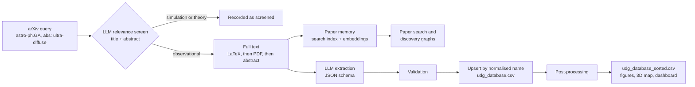
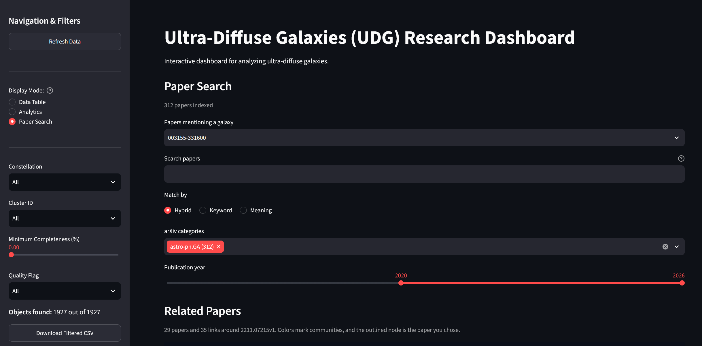
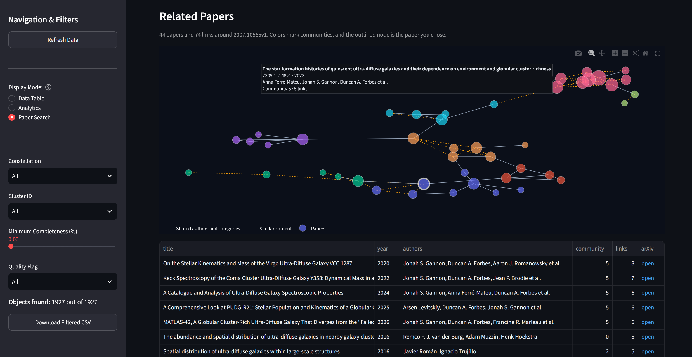

# UDG Catalogue — Automated ETL Pipeline for Ultra-Diffuse Galaxies

<div align="center">

[](https://www.python.org/)
[](https://github.com/xueromll/sci-etl-core)
[](https://streamlit.io/)
[](https://deepseek.com/)
[](#testing)
[](LICENSE)

</div>

> **An automated pipeline that screens astrophysics papers on arXiv and extracts measurements of ultra-diffuse galaxies (UDGs) with DeepSeek V4-Flash. It publishes the results as a cross-matched catalogue of 1,927 objects, explorable through an interactive 3D map and a Streamlit dashboard.**
>
> Every relevant paper is also kept in a local paper memory, so the dashboard can search the literature by keyword and by meaning, find the papers that mention a catalogued galaxy, and grow a graph of related papers.
>
> The ETL machinery comes from [sci-etl-core](https://github.com/xueromll/sci-etl-core): arXiv access, LLM steps, response caching, CSV upserts, resumable state, dataframe processors, local search, embeddings and discovery graphs. This repository holds the astronomy: prompts, galaxy naming and validation rules, sky-position matching, clustering features and the dashboard.

---

## Quickstart

```bash
git clone https://github.com/xueromll/udg-catalogue.git && cd udg-catalogue
python -m venv .venv && source .venv/bin/activate
pip install -r requirements.txt
cp .env.example .env
python main.py
streamlit run app.py
```

Set `DEEPSEEK_API_KEY` in `.env` before running the pipeline. The dashboard also works without it, because it reads the committed `data/udg_database_sorted.csv`. For all options, see [Installation and Usage](#installation-and-usage).

## Key Features

- **Literature screening.** An LLM reads each title and abstract and excludes papers based purely on simulations or theory, such as IllustrisTNG, FIRE or EAGLE studies.
- **Multi-format extraction.** The pipeline reads LaTeX sources first (tarballs or single gzipped files, assembled in document order), then PDFs including their tables, and uses the abstract only as a last resort.
- **Structured LLM extraction.** DeepSeek V4-Flash runs in JSON mode, and every extracted galaxy must pass validation rules before it is stored.
- **Astrometric cross-identification.** Galaxy names are normalised, and records within 3″ on the sky are merged using astropy.
- **Derived columns.** Each object gets a completeness score, a quality flag, its IAU constellation and a 3D spatial group from DBSCAN.
- **Interactive exploration.** A Plotly 3D map and a Streamlit dashboard offer filtering, analytics and CSV export.
- **Paper search.** Each relevant paper's full text is indexed for Boolean keyword search (SQLite FTS5 with BM25) and embedded for search by meaning. Hybrid search fuses both rankings, with category and year filters.
- **Discovery graphs.** Starting from any paper, the dashboard grows a graph of related papers, linked by similar content or shared authors, and groups them into communities.
- **Fault tolerance.** Requests are retried with backoff, and CSV and state writes are crash-safe. Papers that fail are retried on the next run instead of being marked done. Ctrl+C lets papers already in progress finish before the run stops.
- **Cached LLM answers.** Relevance and extraction answers are cached in SQLite, so a rerun or a rebuild never pays twice for the same paper.
- **Bounded async ingestion.** Up to six papers are processed at once.
- **Container-ready.** A Dockerfile and a Compose file are included.

---

## Results at a Glance

| Metric | Value |
|--------|-------|
| **arXiv submissions screened** | 557 |
| **Unique galaxies catalogued** | 1,927 |
| **Objects with all six parameters (`Confirmed`)** | 90 (4.7%) |
| **Objects with sky position and distance (3D map)** | 1,048 |
| **3D spatial groups (DBSCAN)** | 78 |
| **IAU constellations represented** | 44 |
| **Median record completeness** | 66.7% |
| **Literature snapshot** | 2026-09-24 |
| **Total API cost (five full runs)** | US$4.32 |
| **ETL framework** | sci-etl-core 0.4 |

### Parameter coverage

| Parameter | Column | Unit | Objects | Coverage | Median |
|---|---|---|---:|---:|---:|
| Right ascension, declination (ICRS) | `ra`, `dec` | deg | 1,469 | 76.2% | — |
| Distance | `distance_mpc` | Mpc | 1,345 | 69.8% | 53.0 |
| Effective radius | `effective_radius_kpc` | kpc | 1,526 | 79.2% | 1.86 |
| Stellar mass | `stellar_mass_solar` | M☉ | 915 | 47.5% | 6.4 × 10⁷ |
| Dark-matter fraction | `dark_matter_fraction` | — | 97 | 5.0% | 0.89 |

---

## How It Works



| Stage | What happens | Code |
|---|---|---|
| **Screening** | The query `cat:astro-ph.GA AND abs:ultra-diffuse` is paged from the newest submission. The LLM keeps papers with new observational UDG measurements. Every screened ID is saved and never screened again. | [pipeline.py](udg_catalogue/pipeline.py), [prompts.py](udg_catalogue/prompts.py) |
| **Paper memory** | Each relevant paper's title, abstract, full text, authors, categories and year go into a keyword index (`paper_index.db`). The full text is also split into 350-word passages and embedded into `paper_memory.db`. A failure here is logged and never costs the paper its extraction. | [literature.py](udg_catalogue/literature.py) |
| **Extraction** | For each galaxy, the LLM returns `galaxy_name`, `ra`, `dec`, `distance_mpc`, `effective_radius_kpc`, `stellar_mass_solar` and `dark_matter_fraction`. Percentages are converted to fractions, and values the paper doesn't report are `null`. | [prompts.py](udg_catalogue/prompts.py) |
| **Validation** | A record is rejected if its name is missing or contains a simulation keyword as a whole word (e.g. `tng`, `mock`, `toy`). It is also rejected if RA/Dec fall outside [0°, 360°] / [−90°, 90°], or if all six measurements are empty. | [validation.py](udg_catalogue/validation.py) |
| **Name matching** | Names are compared after normalisation: NFKC and case folding, punctuation removed, `Dragonfly` → `DF`, leading zeros stripped. So `DF 44`, `DF-44` and `Dragonfly 044` match, while `KDG 44` and `DF 44` stay distinct. A new record only fills a stored row's missing values and never overwrites them. | [naming.py](udg_catalogue/naming.py) |
| **Sky matching** | Nearest neighbours are found with `SkyCoord.match_to_catalog_sky`. Rows within 3″ are merged, filling gaps without discarding values. | [astrometry.py](udg_catalogue/astrometry.py) |
| **Post-processing** | The dark-matter fraction is clipped to [0, 1], then completeness, constellation, spatial group and quality flag are computed, and rows are sorted. | [postprocess.py](udg_catalogue/postprocess.py) |

**Derived columns**

- `completeness_pct` is the share of the six measurements that are present.
- `quality_flag` is `Confirmed` at 100% completeness, `Needs Review` at ≥ 50% and `Low Confidence` below 50%. It reflects completeness only, not whether the object is a confirmed UDG.
- `constellation` is the IAU constellation of the position, from `SkyCoord.get_constellation`.
- `cluster_id` comes from DBSCAN (`eps = 5 Mpc`, `min_samples = 2`) run on heliocentric Cartesian coordinates $(D\cos\delta\cos\alpha,\ D\cos\delta\sin\alpha,\ D\sin\delta)$. It is −1 for ungrouped objects and for objects without a position or distance.

---

## Catalogue Schema

`data/udg_database_sorted.csv` has one row per object. Rows are sorted by completeness (descending), then by constellation, cluster and name.

| Column | Type | Unit | Description |
|---|---|---|---|
| `galaxy_name` | string | — | Designation as first extracted |
| `completeness_pct` | float | % | Share of the six measurements present |
| `quality_flag` | string | — | `Confirmed`, `Needs Review` or `Low Confidence` |
| `constellation` | string | — | IAU constellation, or `Unknown` without a valid position |
| `cluster_id` | integer | — | DBSCAN group label; −1 if ungrouped |
| `ra`, `dec` | float | deg | ICRS coordinates |
| `distance_mpc` | float | Mpc | Distance |
| `effective_radius_kpc` | float | kpc | Effective (half-light) radius |
| `stellar_mass_solar` | float | M☉ | Stellar mass |
| `dark_matter_fraction` | float | — | Dark-matter fraction in [0, 1] |

Empty cells mean the value was not reported or could not be extracted.

## Known Limitations

Values are extracted automatically, so check them against the original papers before using them in quantitative work.

- **Unchecked extraction.** No values were checked by hand, and a few are physically implausible (for example, one object has $M_\star > 10^{11}$ M☉).
- **No provenance or uncertainties.** The catalogue does not record which paper each value came from, and error bars and upper limits are discarded.
- **Mixed definitions.** Distance methods, photometric bands and dark-matter apertures differ between papers and are not recorded.
- **First value wins.** When papers disagree, the value from the first paper processed is kept.
- **No UDG definition imposed.** The catalogue takes each paper's classification as given and applies no size or surface-brightness cut, such as $R_\mathrm{e} \geq 1.5$ kpc and $\mu_{0,g} \geq 24$ mag arcsec⁻² ([van Dokkum et al. 2015](https://doi.org/10.1088/2041-8205/798/2/L45)).
- **Spatial groups are not bound structures.** With `min_samples = 2`, any two objects within 5 Mpc form a group, and distance errors are often of that size.
- **Remaining duplicates.** Name variants outside the normalisation rules (e.g. `N1052-DF2` and `NGC 1052-DF2`) are merged only when both records have coordinates.
- **Not exactly reproducible.** LLM output varies between runs, so a rebuild gives a similar catalogue, not an identical file.

---

## Tech Stack

| Domain | Technologies |
|--------|-------------|
| **Language** | Python 3.11 |
| **ETL framework** | sci-etl-core (arXiv extraction, LLM steps, CSV upsert, state, processors) |
| **AI / LLM** | DeepSeek V4-Flash through sci-etl-core's OpenAI-compatible client |
| **Document parsing** | pdfplumber, LaTeX parsing in sci-etl-core |
| **Data processing** | pandas, NumPy, scikit-learn (DBSCAN) |
| **Search** | sci-etl-core search (SQLite FTS5, BM25, rank fusion, discovery graphs), sentence-transformers embeddings |
| **Astronomy** | astropy (coordinates, cross-matching, constellations) |
| **Visualization** | Plotly, Matplotlib, seaborn |
| **Dashboard** | Streamlit |
| **Configuration** | YAML + `.env`, validated by Pydantic |
| **Containerization** | Docker Compose |

---

## Project Structure

```text
udg-catalogue/
├── main.py                  # Command-line entrypoint: ingest, post-process, report
├── app.py                   # Streamlit dashboard
├── config.yaml              # Pipeline, paths, embeddings, search, clustering and deduplication settings
├── data/
│   └── udg_database_sorted.csv  # Released catalogue; local pipeline state is written here too
├── output/                  # Figures, 3D map and run log (generated, not committed)
├── udg_catalogue/
│   ├── config.py            # CatalogueConfig, built on sci-etl-core's BaseAppConfig
│   ├── pipeline.py          # Assembles the ingestion and paper-indexing pipelines
│   ├── literature.py        # Paper memory: search index, embeddings, search and discovery graphs
│   ├── paper_views.py       # Snippet highlighting and graph layout for the dashboard
│   ├── prompts.py           # LLM system prompts
│   ├── naming.py            # Galaxy name normalizer used as the catalogue key
│   ├── validation.py        # Rules every extracted galaxy must pass
│   ├── astrometry.py        # Sky matching, 3D features, constellations, cross-matching
│   ├── postprocess.py       # Processor chain that builds the sorted catalogue
│   ├── maps.py              # Plotly 3D map shared by main.py and the dashboard
│   └── analytics.py         # Statistical figures shared by main.py and the dashboard
├── tests/                   # Offline test suite
├── assets/                  # README screenshots
├── requirements.txt         # Runtime install with sci-etl-core from PyPI
├── requirements/
│   ├── app.txt              # Pinned third-party dependencies
│   ├── dev.txt              # Test dependencies
│   └── local.txt            # Runtime install against a local sci-etl-core checkout
├── Dockerfile               # Container setup
├── compose.yaml             # Docker Compose file
├── LICENSE                  # MIT License
└── README.md                # This file
```

### Generated files

| File | Committed | Contents |
|---|---|---|
| `data/udg_database_sorted.csv` | yes | Released catalogue |
| `data/udg_database.csv` | no | Raw upserted extractions, input to post-processing |
| `data/processed_arxiv_ids.txt`, `data/pipeline_meta.json` | no | Resumable pipeline state |
| `data/paper_index.db`, `data/paper_memory.db` | no | Paper memory: keyword index and passage embeddings |
| `data/indexed_arxiv_ids.txt`, `data/indexing_meta.json` | no | Resumable state of `--index-papers` |
| `data/llm_cache.db` | no | Cached LLM answers |
| `output/figures/*.png` | no | Statistical figures (300 dpi) |
| `output/udg_3d_map.html` | no | Standalone 3D map |
| `output/pipeline.log` | no | Run log |

Every location can be changed under `paths` in `config.yaml`. Relative paths are resolved against the directory that holds the config file.

---

## Installation and Usage

### Local Installation

```bash
git clone https://github.com/xueromll/udg-catalogue.git
cd udg-catalogue
python -m venv .venv
source .venv/bin/activate
pip install -r requirements.txt
cp .env.example .env
```

On Windows, activate with `.venv\Scripts\activate`. Then set `DEEPSEEK_API_KEY` in `.env`.

### Running the Pipeline

| Command | What it does |
|---------|--------------|
| `python main.py` | Reads arXiv from the newest submission until it reaches the papers the last run saw first, then continues from the offset saved in `pipeline_meta.json`, so new submissions are picked up without rescanning the whole listing. Papers already screened are skipped. Then rebuilds the sorted catalogue, analytics figures and 3D map. |
| `python main.py --rescan` | Pages the whole listing from the newest submission, for example after arXiv reorders it |
| `python main.py --index-papers` | Adds papers screened before the paper memory existed to the search index, without extracting galaxies (see [Paper Search](#paper-search)) |
| `python main.py --skip-ingestion` | Rebuilds the outputs from an existing `udg_database.csv` without calling arXiv or DeepSeek |
| `python main.py --config other.yaml` | Uses another configuration file; its paths are resolved relative to that file |

The exit code is `0` on success and `2` when `DEEPSEEK_API_KEY` is missing, or `EMBEDDING_API_KEY` with the `openai` embeddings provider. It is `1` when ingestion was aborted; the outputs are still rebuilt from the data already collected. Press Ctrl+C once to stop cleanly: papers in progress finish, the state is saved, and the exit code is `130`. A second Ctrl+C stops at once.

### Configuration

| Key in `config.yaml` | Default | Purpose |
|---|---|---|
| `pipeline.search_query` | `cat:astro-ph.GA AND abs:ultra-diffuse` | arXiv selection query |
| `pipeline.total_limit` | `500` | Relevant papers read in full per run |
| `pipeline.max_concurrency` | `6` | Papers processed concurrently |
| `pipeline.newest_first` | `true` | Stop at the papers the last run saw first, then resume from the saved offset |
| `embeddings.enabled` | `true` | Embed passages for search by meaning; `false` keeps keyword search only |
| `embeddings.provider` / `embeddings.model` | `local` / `all-MiniLM-L6-v2` | `local` runs sentence-transformers; `openai` calls an OpenAI-compatible endpoint |
| `embeddings.base_url` | `https://api.openai.com/v1` | Endpoint of the `openai` provider |
| `embeddings.chunk_words` / `embeddings.overlap_words` | `350` / `50` | Passage length and overlap, in words |
| `search.graph.depth` / `search.graph.fanout` / `search.graph.max_nodes` | `2` / `8` / `80` | How far and how wide a discovery graph grows |
| `search.graph.min_weight` | `0.35` | Weakest link kept in a discovery graph |
| `http.max_retries` / `http.backoff_factor` | `4` / `5.0` | Retry policy for arXiv requests |
| `deduplication.max_separation_arcsec` | `3.0` | Sky-matching radius |
| `clustering.max_distance_mpc` | `5.0` | DBSCAN `eps` |
| `clustering.min_samples` | `2` | DBSCAN `min_samples` |

Configuration written for sci-etl-core 0.2 used `pipeline.max_records` and `pipeline.max_workers`. They still load until sci-etl-core 0.5, with a deprecation warning.

### Paper Search

New papers enter the paper memory as the pipeline reads them. Papers screened before the memory existed are skipped by the pipeline, so index them once:

```bash
python main.py --index-papers
```

It lists the arXiv query again, asks DeepSeek whether each paper not yet indexed is relevant, and indexes the relevant ones without extracting galaxies. Its progress is saved in `indexed_arxiv_ids.txt` and `indexing_meta.json`, so it can be stopped and resumed. The relevance answers it gets are cached in `llm_cache.db`.

The default `local` embeddings provider downloads the `all-MiniLM-L6-v2` model (about 90 MB) on first use and needs no API key. To use a hosted model instead, set `embeddings.provider: openai`, a `model` such as `text-embedding-3-small`, and `EMBEDDING_API_KEY` in `.env`. Changing the provider or model makes existing embeddings incomparable with new ones, so delete `data/paper_memory.db` and run `python main.py --index-papers --rescan` afterwards. `paper_index.db` can stay.

### Rebuilding the Catalogue From Scratch

The committed catalogue was rebuilt from scratch on 2026-09-24 with sci-etl-core 0.4. Catalogues extracted before the migration could merge distinct galaxies that shared a catalogue number, such as `KDG 44` and `DF 44`, or `NGC 1052-DF2` and `NGC 1052-DF4`. The rebuilt catalogue keeps them apart. The pipeline never splits rows it has already merged, so rebuild again whenever the name-matching rules or the extraction prompt change. To rebuild, archive the raw data and state, then run the pipeline:

```bash
mkdir -p archive
mv data/udg_database.csv data/processed_arxiv_ids.txt data/pipeline_meta.json archive/
python main.py --rescan
```

A rebuild reprocesses every matching paper. The 2026-09-24 rebuild screened 557 submissions, read 312 relevant papers in full, and cost ¥11.51 (about US$1.71). Answers already in `data/llm_cache.db` cost nothing, so move it to `archive/` as well to get fresh answers from the model.

### Docker (Recommended)

```bash
docker compose up --build
```

The dashboard is served at `http://localhost:8501`. The Compose file passes `DEEPSEEK_API_KEY` and `EMBEDDING_API_KEY` from your environment and mounts the project directory, so the container reads and writes the same catalogue files and paper memory as a local run. The image installs the CPU build of PyTorch, and the embedding model is cached in `.cache/` inside the project directory, so it is downloaded once. To run the pipeline inside the container:

```bash
docker compose run --rm udg-pipeline python main.py
```

### Developing Against a Local sci-etl-core

To change the library and this project together, install sci-etl-core in editable mode instead of from PyPI. `requirements/local.txt` expects the checkout at `../../sci-etl-core`, relative to the project root that you run pip from; adjust the path if yours lives elsewhere.

```bash
pip install -r requirements/local.txt
python -c "import sci_etl_core; print(sci_etl_core.__file__)"
```

The second command should print a path inside your sci-etl-core checkout. An editable install records its absolute path, so reinstall if you move the checkout. `requirements.txt` accepts any 0.4.x release of sci-etl-core; raise the range there to move to a newer minor release after running the tests against it.

---

## Dashboard Features

* **3D Interactive Map.** Explore the 1,048 galaxies that have a sky position and distance, colour-coded by:
  * Dark Matter Fraction
  * Completeness (%)
  * Distance (Mpc)
  * Cluster ID
* **Filtering.** Filter by constellation, cluster, minimum completeness and quality flag.
* **Data Table.** Paginated view with 10, 50 or 100 objects per page.
* **Analytics View.** Stellar mass and effective radius distributions, plus a mass–radius scatter plot coloured by completeness, all computed on the filtered selection.
* **Data Export.** Download the filtered selection as CSV.
* **Refresh Data.** Re-run post-processing on `data/udg_database.csv` without ingesting new papers.
* **Paper Search.** Search the indexed papers by keyword, by meaning, or both (hybrid), with Boolean syntax such as `"dark matter" -simulation`, `title:dwarf*` or `NEAR(globular cluster, 5)`. Filter by arXiv category and publication year, and see the matching passage of each paper with the matched words highlighted.
* **Papers Mentioning a Galaxy.** Pick a galaxy from the (filtered) catalogue to find the papers whose text names it.
* **Related Papers.** Grow a discovery graph around any result: papers linked by similar content or shared authors, coloured by community, with a table of arXiv links. The category and year filters prune a graph that is already grown, and moving to a paper that was already in a graph reuses the links found for it.

The dashboard keeps one paper library open for as long as it runs, so the search index, the vector memory and the embedding client are opened once rather than on every search. The links remembered for related papers are forgotten when the paper index changes.

To point the dashboard at another configuration file, set `UDG_CATALOGUE_CONFIG` to its path.

The map's radial axis is scaled as √distance so that nearby and distant galaxies are visible together. Use the catalogue columns, not the plot axes, for distance measurements.

---

## Gallery

### Galaxy Map


*Interactive 3D map of UDGs with known position and distance. Hover over any point to see its constellation, cluster, completeness and measured parameters.*

### Analytics Dashboard


*Statistical plots: stellar mass distribution, effective radius distribution and the mass–radius relation coloured by completeness.*

### Paper Search



*Search the indexed papers by keyword, by meaning, or both, filtered by arXiv category and publication year, or pick a galaxy to find the papers that mention it.*

### Related Papers



*Discovery graph around a chosen paper. Solid lines link papers with similar content, dashed lines link papers with shared authors and categories, and colours mark communities. The table below lists each paper with its arXiv link.*

---

## Testing

The test suite runs offline. arXiv is replaced by an in-memory Atom feed and e-print, DeepSeek by a scripted client, the embedding model by a word-hashing embedder, and the dashboard is exercised with Streamlit's `AppTest`.

```bash
pip install -r requirements/dev.txt
pytest --cov
```

Coverage of `udg_catalogue` and `main.py` must stay at 100%. `pyproject.toml` enforces this, and CI checks it on every push and pull request.

Beyond unit tests:

- **End-to-end runs.** The pipeline was run five times from a cleared state. The runs checked robustness to missing or malformed PDFs, JSON schema parsing with percentage conversion, and the deduplication and clustering steps.
- **Verified migration.** The move to sci-etl-core was checked by replaying the catalogue through the old and new code. The CSV upserts matched exactly. The sorted catalogue matched cell for cell, except for three rows with an invalid right ascension. The walkthrough is the case study in sci-etl-core's [MIGRATION.md](https://github.com/xueromll/sci-etl-core/blob/master/MIGRATION.md).

---

## Future Work

* [x] Integrate **sci-etl-core** as a reusable library
* [ ] Add support for other astronomical catalogues (e.g., dSph, LSB galaxies)
* [ ] Deploy Streamlit dashboard to Streamlit Cloud
* [ ] Add automated weekly updates via GitHub Actions

---

## Contributing

Contributions are welcome, from corrections to catalogue values to code improvements. Please open an issue first to discuss what you'd like to change. See [CONTRIBUTING.md](CONTRIBUTING.md) for guidelines.

---

## Citation

If you use this project in your research, please cite it, together with the original papers for any values you use:

```bibtex
@misc{udg_catalogue_2026,
  author       = {Lan},
  title        = {{UDG Catalogue}: Automated ETL Pipeline for Ultra-Diffuse Galaxies},
  year         = {2026},
  howpublished = {GitHub repository},
  url          = {https://github.com/xueromll/udg-catalogue}
}
```

---

## License

Released under the MIT License. See the [LICENSE](LICENSE) file for details. Measurements in the catalogue belong to the authors of the original publications.

---

## Acknowledgments

* **arXiv:** thank you to arXiv for use of its open access interoperability
* **Astropy:** a community-developed core Python package for astronomy
* **DeepSeek:** for their LLM API
* All the astrophysicists whose papers made this catalogue possible

---

## Contact

Maintained by **Lan**

GitHub: [xueromll](https://github.com/xueromll)

Email: [lanhua1122333@gmail.com](mailto:lanhua1122333@gmail.com)
